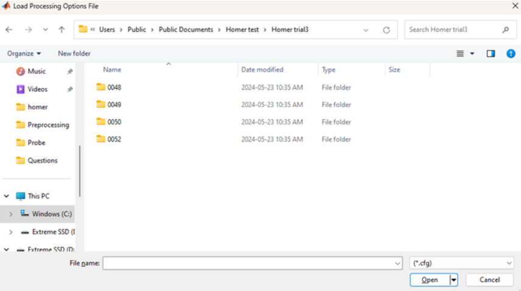

# Scope 
This document gives instructions on Homer3 software that does data analysis for .snirf files. Homer3 is a Matlab application used for analyzing fNIRS data to obtain estimates and maps of brain activation.  In order to understand the biological basis of the data, physics of the device, etc, please feel free to reach akshayakirithybaskar@cmail.carleton.ca

# General Instructions (Run level analysis)
1)	Install Homer using the link given and instructions provided. Note: Please install MATLAB 17b run time for installation. MATLAB coexist with the other versions of MATLAB, so please do not remove the recent ones. Make sure to download source codes of Homer3 as well and install it correctly.
https://github.com/BUNPC/Homer3/wiki/Download-and-Installation
2)	Open recent version of MATLAB and set the path as …\homer3\Homer3-1.87.0
3)	In the command window of MATLAB, please type setpaths -> Click Enter
4)	The toolboxes will be loaded. If the prompt says, that you are missing tool boxes, please install it using AddOn option.
5)	In the command window of MATLAB, please type Homer3 -> Click Enter
Note: Alternatively, you can change path to the data folder before you enter Homer3 on command window. Your data will be loaded by the GUI. You can ignore step 7 and then move on
6)	The GUI window will be loaded with some sample data given by the software developers.
7)	Click File -> Change folder, to set the folder where your data is available.  
8)	If ‘Loading Processing Option File’ window pops up, click cancel. Creation of processing file (.cfg) is given after few steps. Once you create it, you can select it during this step. Clicking cancel do not hamper the process. 

9)	Once the GUI loads your data, you can see the montage, on the right side of the screen. The blue and red lines refers to the trials. The condition is marked by the color difference and legend will be given at the top.

10)	By clicking the Raw data option and selecting any channel, you can visualize the raw data.

11)	In order to process the data, you need to build a processing stream. Processing stream consists of functions that you would like to do for your data (eg. converting in to concentration, filtering, motion correction). This is done by Click Tools -> Edit Processing Stream. Processing stream editor will be opened.

12)	This has number of functions that needed to be added for your data processing. Default set up of analysis involves hmrR_Intensity2OD, hmrR_OD2Conc, hmrR_BandpassFilt. Other functions can be added according to your requirement. 
Note: Click this link to learn about processing streams https://github.com/BUNPC/Homer3/wiki/Processing-Functions
13)	For simple processing, use hmrR_Intensity2OD, hmrR_OD2Conc, hmrR_BandpassFilt, hmrR_BlockAvg. Click and add those functions in the processing stream editor one by one.

 

14)	You can save this processing stream for future use by clicking Save -> Config File (future usage). You can apply the functions on the current data processing by clicking Save ->  Current Processing stream. And close the processing stream window.
15)	Click Edit Options, to customize the functions according to your data requirements by entering the values. 

16)	Once you finish editing, click exit. 
17)	Click Run to proceed with the analysis

18)	Thus the basic steps to analyze data has been performed. But in order to improve the data quality motion corrections should be done properly depending upon your requirement. Also GLM should be applied to eliminate the short channel impacts. These steps can be performed by adding respective functions in the processing stream.

# Processing streams
The basic processing streams typically include four functions (use only if you don't use short channels)
- hmrR_Intensity2OD: converts raw data to optical density
- hmrR_BandpassFilt: performs a band-pass filter on optical density data
- hmrR_OD2Conc: converts the filtered optical density to hemoglobin concentration
- hmrR_BlockAvg: and finally calculates the average hemodynamic response function (HRF)

The following processing stream provides processing and parameters for short-separation regression using the GLM approach, typically including four functions:
- hmrR_Intensity2OD: converts raw data to optical density
- hmrR_BandpassFilt: performs a band-pass filter on optical density data
- hmrR_OD2Conc: converts the filtered optical density to hemoglobin concentration
- hmrR_GLM: and finally estimates the HRF using GLM analysis

  Below given image explains how the short channel effect is eliminated by changing the values of rhoSD_ssThresh

## Motion artifact detection and rejection
fNIRS allows measurements in relatively unrestrained environments and is prone to motion artifacts (MAs). Homer3 enables you to identify MAs and discard MA-contaminated trials from your analysis. 
These MA functions are applicable only if the raw data is converted as optical density using hmrR_Intensity2OD.

### hmrR_MotionArtifactByChannel 
Identifies motion artifacts in an input data matrix d. If any active data channel exhibits a signal change greater than std_thresh or amp_thresh, then a segment of data around that time point is marked as a motion artifact. The channel-wise motion artifacts are recorded in the output matrix tIncCh. If any channel has a motion artifact, it is indicated by the vector tInc.
#### Default Parameters :
- tMotion: 0.5
- tMask: 1.0
- STDEVthresh: 50.0
- AMPthresh: 5.00

This image shows the motion artifact by channel with function that needed to be selected. Values are away from default to show the artifact.

### hmrR_StimRejection
Excludes stims that fall within the time points identified as motion artifacts from HRF calculation.
#### Default Parameters :
- tRange: [-5.0, 10.0]

### hmrR_PruneChannels 
Prune channels from the measurement list if their signal is too weak, too strong, or their standard deviation is too great. Whether the data meets these conditions depends on the parameters of this function: dRange, SNRthresh, SDrange, and reset.
#### Default Parameters :
- dRange: [1e4, 1e7]
- SNRthresh: 2
- SDrange: [0.0, 45.0]

## Motion artifact corrections
If you have a limited number of trials, motion artifact correction would be a better option than StimRejection. There are multiple advanced functions you can incorporate in the processing stream to perform motion artifact correction, such as MotionCorrectSpline, MotionCorrectPCA, MotionCorrectPCArecurse, MotionCorrectWavelet, and MotionCorrectCbsi.
Here gives the processing stream containing all MA correction options and their typical parameters.

### hmrR_MotionCorrectSpline
Perform a cubic spline correction of the motion artifacts identified in tIncCh. The algorithm follows the procedure describe by Scholkmann et al., Physiol. Meas. 31, 649-662 (2010). Set p = -1 to skip this function.
#### Default Parameters :
- p=0.99
- turnon=1

Spline corrections works only if the motion artifact is identified by the function. So make sure you use proper set of functions together.

### hmrR_MotionCorrectPCA
This function uses PCA to filter only the segments of data identified as a motion artifact. The motion artifacts are indicated in the tInc vector by the value of 0.
#### Default Parameters :
- nSV: 0.0

This image shows the motion artifact correction using PCA filter with function that needed to be selected. 

### hmrR_MotionCorrectPCArecurse
Identified motion artifacts in an input data matrix d. If any active data channel exhibits a signal change greater than STDEVthresh or AMPthresh, then a segment of data around that time point is marked as a motion artifact. Set turnon=0 to skip this function.
#### Default Parameters :
- tMotion: 0.5
- tMask: 1.0
- STDEVthresh: 20.0
- AMPthresh: 5.00
- nSV: 0.97
- maxIter: 5
- turnon: 1

### hmrR_MotionCorrectWavelet
Perform a wavelet transformation of the dod data and computes the distribution of the wavelet coefficients. It sets the coefficient exceeding iqr times the interquartile range to zero because these are probably due to motion artifacts. set iqr<0 to skip this function. The algorithm follows in part the procedure described by Molavi et al.,Physiol Meas, 33, 259-270 (2012).
hmrR_PruneChannels is used to prune channels from the measurement list if their signal is too weak, too strong, or their standard deviation is too great. Whether the data meets these conditions depends on the parameters of this function: dRange, SNRthresh, SDrange, and reset.

#### Default Parameters :
- iqr=1.50
- turnon=1

### hmrR_MotionCorrectCbsi
Perform a correlation-based signal improvement of the concentration changes in order to correct for motion artifacts. The algorithm follows the procedure described by Cui et al.,NeuroImage, 49(4), 3039-46 (2010).
#### Default Parameters :
- turnon=1

# Group Analysis 
Group analysis is mostly similar to the individual analysis. There are few steps that need to be followed. 
1) Build your folder structure similar to the one shown in the image. This will be useful while you automate the process. Please do not worry about homerOutput branch, it will be created automatically once you process your data.
2)	Open recent version of MATLAB and set the path as …\homer3\Homer3-1.87.0
3)	In the command window of MATLAB, please type setpaths -> Click Enter
4)	The toolboxes will be loaded.
5)	In the command window of MATLAB, please type Homer3 -> Click Enter
Note: Alternatively, you can also navigate to the group folder before you enter Homer3 on command window, your data will be opened by the GUI. You can ignore step 7 and then move on
6)	The GUI window will be opened with some sample data given by the software developers.
7)	Click File -> Change folder, to set the folder where your group data is available.
8)	Once the GUI opens, you will see the current processing element section with your group data loaded.

9) Click the group folder in the current processing element (Preprocessing in the given image). Click Tools -> Edit Processing Stream. Processing stream editor will be opened. This processing stream has functions for group analysis. 

10) You can save this processing stream for future use by clicking Save -> Config File (future usage) and you can apply the functions on the current data processing by clicking Save ->  Current Processing stream. And close the processing stream window.
11) Click Edit Options, to customize the functions according to your data requirements by entering the values. I have given an example of a processing stream edit window below that performed paired contrast.

