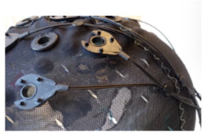
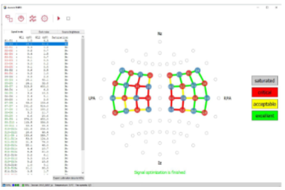

# Scope 
This document gives instructions to design a montage, perform data collection and important information to be noticed during data collection. 

# Design a montage

Designing a montage needs to be done using NIRSite. Once you finish the NIRSite desgin, you have to export that design to Aurora to make sure the data acquisition is implemented for the designed montage. The next step would be setting up the caps. 

## NIRS Site
NIRSite is a very user friendly software which has all the functions listed in the Help section. To design a montage you should be ready with the following details
1) Decide the number of sources and detectors to be used for the experiment
2) Research on the montage design. Have a copy of rough montage which you are willing to design.
3) If you are setting up optodes using the standard systems (e.g 10-10 EEG) please use the 2D view only. 
4) If you are customizing location of optodes out of standard systems, you can use 3D view/2D view.
5) Understand the optode bundles split up and try to design a montage that will be less messier after placing the optodes.

### Exporting it to Aurora

1) Save the montage to the location  where Aurora can access the designed montage. This will be a default set up provided by the lab research assistant.
2) Open Aurora, in the montage configuration screen, click new configuration.
3) You will be navigated to a screen where you have to provide a name for montage and mention how many optodes you are using.
4) In the list at the left corner of the screen, you will find your designed montage. Click that and save it.
5) Your new configuration (montage) is imported to the Aurora.

## Cap set-up

### Components required

1) spring top holders 
2) spring top grommets (top and bottom) 
3) green velcro strap 
4) optode labels 
5) optode stabilizers 
6) cable trees 
7) AC grommets (top and bottom) 
8) red c-ring pliers 
9) appropriately sized cap 
10) optodes 
11) Hair parter 

Please use the components from the respective labs (LNeuro / CANAL Labs)

### Grommets set up 
Setting up the cap is important as we must understand cable management. For the already prepared montage, you can ignore Steps 1-7. Those are steps to build a montage from scratch. 

1) Your first job is to set up the Grommets. Take the cap, top grommet, and bottom grommet, labels, and stabilizer links. 
2) Refer to the montage to find a location where Source 1 is mentioned. You can easily find it by checking the markings on the cap. 
3) Follow the order shown in Figure . Insert the top grommet’s protruded part inside the hole presented by the cap, after placing the label and stabilizer link below. Hold it tight and slowly invert the cap.  

4) Take the bottom grommet and press along the bottom part of the top grommet. If you find it difficult use a plyer. You will hear a tiny pop sound that represents its fit.  
5) Perform this step for all sources and detectors by matching them to the respective positions in the cap. You can use cap positions for mapping. 
6) In some cases, you must use two or more handles of stabilizer links. Do not worry about it.  
7) Once you finish your montage setup, look for the short channel sources. Blue encircled sources are short channel sources (if you are using short channels). 
8) Remove the bottom grommet for the sources that have short channels pointed out. 
9) Insert the short channels below the grommet. Refer the images below for ideal set up of short channels.

10) After attaching 8 short channels, insert some cable trees for cable management. Refer the figure for set up.

11) Flip the cap and now your montage is ready. It is recommended to have a montage ready in all sizes of caps.

# Optodes set up 

1) At this point, you have to take a few steps that comfort the participants. So, there is no one method, please follow the guide to take the necessary steps and you have to evolve according to your experiment.
2) Refer to the figures below, which has the arrangement of the setup. As we are ready with the grommets. Now you must take the optodes set and spring tops and follow the order

3) Spring top holders come with different pressure levels. Refer to Figure 5 to find different labels. For thick or more hair regions please use Hard spring tops. For a no/very little hair region use zero-pressure spring tops. This varies for each participant. So, you must decide it.  

Note: Here is an example for proper management of set up. For the montages that has optodes majorly populated on the sides of the head, you can ask the participants to make a half ponytail of hair. For montages that cover frontal, parietal or occipital it is not recommended as the ponytail will increase the thickness of the hair in those regions. You might find new tips as you evolve with your own montage. Reach out for help if you have any trouble.

5) Please ask the participant to wear the cap which has montages.
6) Remove the cap (cover) of the optode.
7) You need to place it safely over the participant's head by parting the hair using the hair parter. 
8) Place the Source 1 optode on the red label 1 grommet place the spring top holder over it and press it. You will hear a tiny pop sound. Then insert wire through the cable tree for better management of cables. Handle it carefully as the optode is very tender and it's expensive. Make sure the participant is comfortable.  
9) Similarly repeat it for all 16 sources and 15 detectors. 
10) Insert the 16th detector into the coupler of the short channel bundle (IF THE MONTAGE IS DESIGNED WITH SHORT CHANNELS)  
11) Place cable tree organizer for future cable management. You can keep up to 4 and place it in suitable regions. Refer to Figure 7 for the setup.  
12) Perform cable management. You should also use green Velcro straps to control the cables. 
13) You can also change grommets to AC grommets if the participant feels highly uncomfortable. 
14) Connect the sources and detectors to the NIRS system (using cables provided).  

 # NIRx device set up 

1) Turn on the NIRx Sport device. 
2) Check the charge level. 
3) Go to the PC and click the wifi connections. 
4) You will see a network called NSP2_2322_0648_A (Please wait for some time if you did not see it immediately)
5) Connect that network. (please look at the device for password)
6) Click Aurora (not Aurora API) on the desktop.
7) Refer to Figure  for explanations of the menu

8) You will see the fNIRS device icon with a check mark indicating it is connected

9) You will be navigated to the configuration screen. Select the montage.

10) Optimize the signals by clicking the play button.

11) Check whether all channels are green in C.V. If there are red channels, check those channels by adjusting the montage/by parting the hair.
12) Once all the channels are green/yellow, please put the shower cap over the montage setup.
13) Place it gently so that you don’t move around the setup.
14) Navigate to the acquisition window.

15) Keep the task ready and do the necessary steps for setting up the trigger and start the data acquisition.
16) Click red radio button to start to record data by clicking the Record button.
17) Ask the participant to start the task.
18) Recording may be stopped at any time by clicking the Stop button.

# Trigger set up
As of now L-NEURO Lab and CANAL Lab are working on designing tasks using E-Prime and Psychopy. So if you are interested in designing task in some other software, we should figure out the trigger situation. 

## Eprime Trigger Set up
All the below mentioned steps should be performed once you design the experiment in the E-Prime
1) E-Prime trigger set up works with Chronos and NIRx adapter. The set up is given by the image below. The white cord with wire refers the trigger wire which has to be connected to the NIRx adapter and NIRx system. Chronos should be connected to the task computer. Depending upon the task you can use Audio or Aux provisions. 

2) After you finish your initial set up, open the eprime experiment in the E-Studio. Double click the Experiment option mentioned. Refer the image.

3) Go to the Devices tab in the window appeared. Refer the image.

4) Make sure Chronos is available and checked in. If Chronos is not seen please check the connection of chronos to the system. And click Add Device button. Refer image.

5) Select Chronos and Check it.
6) Go to the stimuli where the trigger needs to be set and click properties. In our case its Word1.
7) Go to Task Events tab. In the Events section, click Add -> StimuliName.OnsetTime. In the below image, the trigger is set for Word1.
8) Set the options as the same as in the image. The DigitalOutSetBit, action sends the trigger in reference with the custom values provided in the parameter section. The parameters might vary depending upon the nature of the experiment. Click Apply.
   

9) Next we have to reset the trigger to send out a new one when again the stimuli comes in. In order to do that, you have to choose the event that occurs in the last of a trial. In the case given below, the trigger is sent out when the Word1 begins and it will be reset when Word12 begins. Our trial consist of 12 words. 

10) Choose Word12 properties. Go to Task Events tab. In the Events section, click Add -> StimuliName.OffsetTime. In the below image, the trigger is set for Word12.
11) Set the options as the same given in the image. The DigitalOffSetBit, action reset the trigger in reference with the custom values provided in the parameter section. The parameters might vary depending upon the nature of the experiment.  Click Apply.

If you have more questions about it. Please contact akshayakirithybaskar@cmail.carleton.ca

## Psychopy
1) Connect Task computer and Acquisiton computer in the same network (FNIRS network)
2) Open the psychopy experiment and click play button. Do not start the task.
3) Open lab recorder and check if you can find the Aurora, NS3, PsychoPy.
4) Check those options and make sure they are in green.
5) Click Start.
6) Now start the data acqusition.

# Troubleshooting and clean up 

1) If you cannot connect the device, please restart the device and the Aurora app.
2) If there is a problem with the optimization window. Please look into the hair blockage. Gently remove the hair in that region and place the optode.
3) If you find difficulty in navigating the app or device, please refer to the user guide in the system. You can easily find it.
4) If you have trouble in E-Prime, do not panic. Please reach out to me (I am trying my level best to address the issues, soon there will be a user guide).
5) After the experiment is completed, keep the cap over the towel.
6) Remove the optodes gently from the cap.
7) Take an alcohol wipe and clean the cap, optodes, and shower cap
8) Cover the optodes with its caps and place it inside the box. Reorganize everything.
9) Switch off all the devices when you go out of the room.
10) Please contact me if you find any difficulty Akshaya – akshayakirithybaskar@cmail.carleton.ca 
